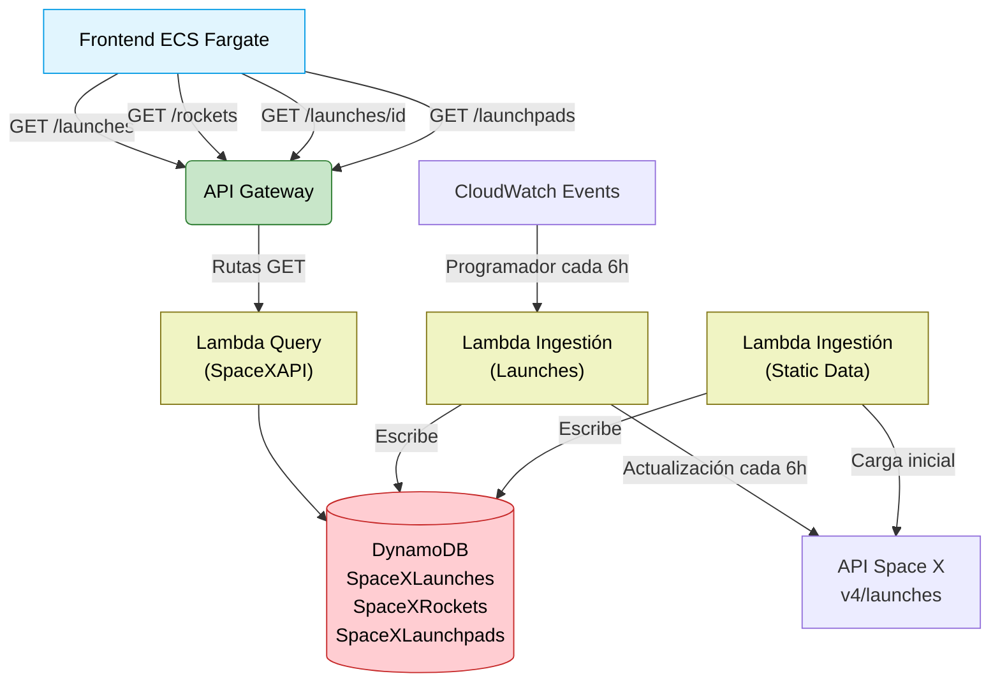
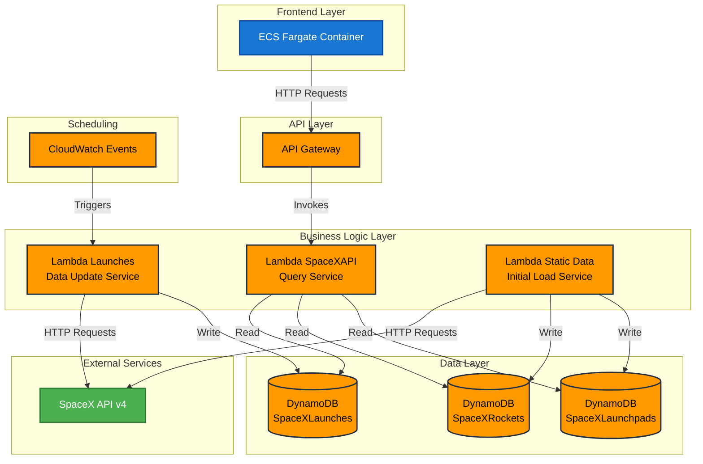

# SpaceX Launches Tracker - Backend 🚀

[](https://aws.amazon.com)
[](https://aws.amazon.com/dynamodb)
[](https://www.python.org)
[](https://aws.amazon.com/api-gateway)
[](https://aws.amazon.com/lambda)
[](LICENSE)

_Sistema serverless para seguimiento de lanzamientos de SpaceX con arquitectura basada en AWS_

---

## 📋 Tabla de Contenidos
1. [Descripción del Proyecto](#-descripción-del-proyecto)
2. [Diagramas de Arquitectura](#-diagramas-de-arquitectura)
3. [Configuración de DynamoDB](#-configuración-de-dynamodb)
4. [Funciones Lambda](#-funciones-lambda)
5. [API Endpoints](#-api-endpoints)
6. [Estructura del Proyecto](#-estructura-del-proyecto)
7. [Despliegue](#-despliegue)
8. [Pruebas Unitarias](#-pruebas-unitarias)
9. [Autor](#-autor)
10. [Licencia](#-licencia)

## 📝 Descripción del Proyecto

Este proyecto implementa un backend serverless que rastrea y almacena información sobre lanzamientos de SpaceX. Utiliza la API pública de SpaceX para obtener datos actualizados cada 6 horas y los expone a través de una API REST.

**Características principales:**
- Arquitectura serverless completamente gestionada en AWS
- Actualización automática de datos cada 6 horas
- Endpoints optimizados para consultas de lanzamientos, cohetes y plataformas
- Almacenamiento eficiente en DynamoDB con escalado automático

## 📊 Diagramas de Arquitectura

### Flujo de Datos



### Diagrama Detallado de AWS



### Componentes de AWS en Detalle

| Servicio | Propósito | Configuración |
|----------|-----------|---------------|
| **API Gateway** | Gestiona las solicitudes HTTP entrantes y las dirige a Lambda | • Autenticación: API Key<br>• Límites de tasa: 100 req/s<br>• Caché: Activada (TTL 10 min) |
| **Lambda** | Ejecuta código sin aprovisionar servidores | • Runtime: Python 3.12 |
| **DynamoDB** | Base de datos NoSQL para almacenamiento de datos | • Modo Capacidad: Bajo demanda<br>• Clases de tabla: Estándar |
| **CloudWatch Events** | Programa la ejecución de tareas | • Regla: rate(6 hours)<br>• Target: Lambda Launches |

## 💾 Configuración de DynamoDB

### 1. **Crear tablas** 

Ejecutar en AWS CLI:

```bash
aws dynamodb create-table \
    --table-name SpaceXLaunches \
    --attribute-definitions AttributeName=id,AttributeType=S \
    --key-schema AttributeName=id,KeyType=HASH \
    --billing-mode PAY_PER_REQUEST \
    --region us-east-1
```

Repetir para `SpaceXRockets` y `SpaceXLaunchpads` con la misma estructura básica.

### 2. **Esquema de datos**

#### SpaceXLaunches

| Atributo | Tipo | Descripción |
|----------|------|-------------|
| `id` | String | Identificador único del lanzamiento (Clave primaria) |
| `date_utc` | String | Fecha y hora del lanzamiento en formato UTC |
| `mission_name` | String | Nombre de la misión |
| `status` | String | Estado del lanzamiento (success, failure, upcoming) |
| `rocket_id` | String | ID del cohete utilizado para el lanzamiento |
| `details` | String | Detalles adicionales sobre el lanzamiento (opcional) |
| `launchpad_id` | String | ID de la plataforma de lanzamiento |

#### SpaceXRockets

| Atributo | Tipo | Descripción |
|----------|------|-------------|
| `id` | String | Identificador único del cohete (Clave primaria) |
| `name` | String | Nombre del cohete |
| `type` | String | Tipo de cohete |
| `active` | Boolean | Indica si el cohete está actualmente activo |
| `description` | String | Descripción detallada del cohete |
| `first_flight` | String | Fecha del primer vuelo |

#### SpaceXLaunchpads

| Atributo | Tipo | Descripción |
|----------|------|-------------|
| `id` | String | Identificador único de la plataforma (Clave primaria) |
| `name` | String | Nombre corto de la plataforma |
| `full_name` | String | Nombre completo de la plataforma |
| `locality` | String | Localidad donde se encuentra |
| `region` | String | Región geográfica |
| `status` | String | Estado operativo actual |
| `details` | String | Información adicional |

## 🧩 Funciones Lambda

### 1. **API (Query)**

- **Responsabilidad**: Servir datos a través de API Gateway
- **Runtime**: Python 3.12
- **Permisos IAM**:
  ```json
  {
    "Version": "2012-10-17",
    "Statement": [
      {
        "Effect": "Allow",
        "Action": [
          "dynamodb:GetItem",
          "dynamodb:Scan",
          "dynamodb:Query"
        ],
        "Resource": [
          "arn:aws:dynamodb:us-east-1:*:table/SpaceXLaunches",
          "arn:aws:dynamodb:us-east-1:*:table/SpaceXRockets",
          "arn:aws:dynamodb:us-east-1:*:table/SpaceXLaunchpads"
        ]
      }
    ]
  }
  ```

- **Estructura básica**:
```python
import json
import boto3

# Inicializar cliente DynamoDB
dynamodb = boto3.resource('dynamodb')

def lambda_handler(event, context):
    path = event.get('path', '')
    method = event.get('httpMethod', '')
    
    # Determinar la operación basada en la ruta
    if method == 'GET':
        if path == '/launches':
            return get_all_launches()
        elif path.startswith('/launches/') and len(path) > 10:
            launch_id = path.split('/')[-1]
            return get_launch_by_id(launch_id)
        # Otras rutas...
```

### 2. **Ingestion (Launches)**

- **Trigger**: CloudWatch Events (cada 6 horas)
- **Runtime**: Python 3.12
- **Código clave**:

```python
import json
import boto3
import requests

# Inicializar cliente DynamoDB
dynamodb = boto3.resource('dynamodb')

def handler(event, context):
    # Obtener datos de lanzamientos
    response = requests.get('https://api.spacexdata.com/v4/launches')
    launches = response.json()
    
    # Actualizar tabla de lanzamientos en DynamoDB
    update_launches(launches)
```

### 3. **Ingestion (Static Data)**

- **Responsabilidad**: Carga inicial de datos estáticos (cohetes y plataformas)
- **Runtime**: Python 3.12
- **Código clave**:

```python
import json
import boto3
import requests

# Inicializar cliente DynamoDB
dynamodb = boto3.resource('dynamodb')

def handler(event, context):
    # Obtener datos de cohetes
    response_rockets = requests.get('https://api.spacexdata.com/v4/rockets')
    rockets = response_rockets.json()
    
    # Obtener datos de plataformas
    response_launchpads = requests.get('https://api.spacexdata.com/v4/launchpads')
    launchpads = response_launchpads.json()
    
    # Actualizar tablas en DynamoDB
    update_rockets(rockets)
    update_launchpads(launchpads)
```

## 🌐 API Endpoints

| Endpoint           | Método    | Descripción                          |
| ------------------ | --------- | ------------------------------------ |
| `/launches`        | GET       | Lista todos los lanzamientos         |
| `/launches/{id}`   | GET       | Detalle de un lanzamiento específico |
| `/rockets`         | GET       | Lista de cohetes                     |
| `/launchpads`      | GET       | Lista de plataformas                 |

### Ejemplos de Respuestas:

#### Lanzamiento Individual
```json
{
  "id": "605b4b95aa5433645e37d041",
  "mission_name": "Starlink-26",
  "date_utc": "2021-05-15T22:54:00.000Z",
  "status": "success",
  "rocket": {
    "id": "5e9d0d95eda69973a809d1ec",
    "name": "Falcon 9"
  }
}
```

## 📁 Estructura del Proyecto

```
backend/
├── lambdas/
│   ├── api/
│   │   ├── app.py
│   │   └── tests/
│   │       └── test_app.py
│   └── ingestion/
│       ├── launches/
│       │   ├── app.py
│       │   └── tests/
│       │       └── test_app.py
│       └── static data/
│           ├── app.py
│           └── tests/
│               └── test_app.py
└── README.md        # Esta documentación
```

## 🚀 Despliegue

### 1. **Preparación de Dependencias**

```bash
# Crear entorno virtual
python -m venv venv
source venv/bin/activate

# Instalar dependencias
pip install -r requirements.txt
```

### 2. **Empaquetar Lambda**

```bash
# Crear directorios para las funciones
mkdir -p build/api build/ingestion/launches build/ingestion/static_data

# Copiar código al directorio de compilación
cp lambdas/api/app.py build/api/lambda_function.py
cp lambdas/ingestion/launches/app.py build/ingestion/launches/lambda_function.py
cp lambdas/ingestion/static\ data/app.py build/ingestion/static_data/lambda_function.py

# Instalar dependencias en el directorio de compilación
pip install -t build/api/ boto3
pip install -t build/ingestion/launches/ boto3 requests
pip install -t build/ingestion/static_data/ boto3 requests

# Comprimir funciones
cd build/api && zip -r ../../lambda-api.zip . && cd ../..
cd build/ingestion/launches && zip -r ../../../lambda-launches.zip . && cd ../../..
cd build/ingestion/static_data && zip -r ../../../lambda-static-data.zip . && cd ../../..
```

### 3. **Implementar Recursos**

```bash
# Subir código de las funciones
aws lambda update-function-code \
    --function-name SpaceXAPI \
    --zip-file fileb://lambda-api.zip

aws lambda update-function-code \
    --function-name SpaceXLaunches \
    --zip-file fileb://lambda-launches.zip

aws lambda update-function-code \
    --function-name SpaceXStaticData \
    --zip-file fileb://lambda-static-data.zip
```

## 🧪 Pruebas Unitarias

### Estructura de las pruebas
Las pruebas se encuentran junto a cada módulo en la carpeta `tests`.

```
lambdas/api/tests/test_app.py
lambdas/ingestion/launches/tests/test_app.py
lambdas/ingestion/static data/tests/test_app.py
```

### Ejecutar pruebas

```bash
# Ejecutar todas las pruebas
pytest lambdas/

# Ejecutar pruebas específicas
pytest lambdas/api/tests/
pytest lambdas/ingestion/launches/tests/
pytest lambdas/ingestion/static\ data/tests/
```

## 👨‍💻 Autor

**Sebastian Ballen C** - *Frontend Developer*

* LinkedIn: [Sebastian B.](www.linkedin.com/in/sebastianballencastaneda-softwaredeveloper)
* Email: sebastian.ballenc@gmail.com

## 📄 Licencia

Este proyecto está licenciado bajo la Licencia MIT - vea el archivo [LICENSE](LICENSE) para más detalles.

---

⭐️ **Si te resulta útil este proyecto, ¡no olvides darle una estrella en GitHub!** ⭐️
