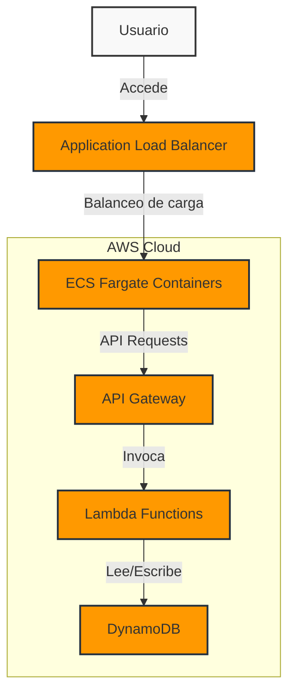
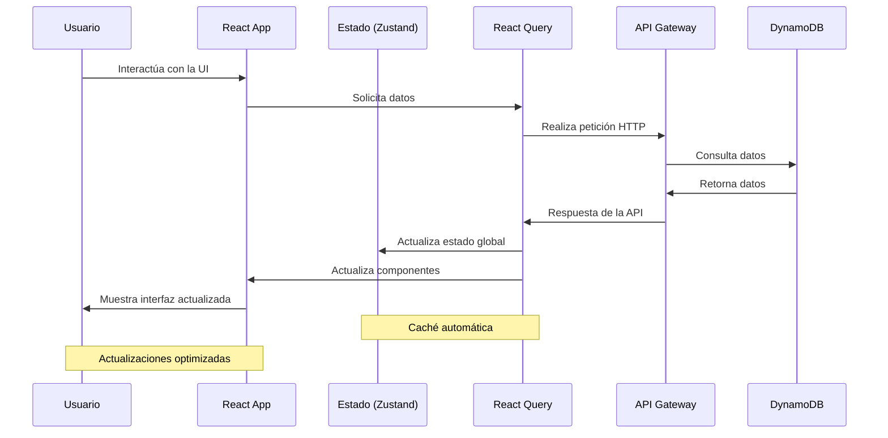

# SpaceX Launches Tracker - Frontend 🚀

[](https://reactjs.org/)
[](https://tailwindcss.com/)
[](https://zustand-demo.pmnd.rs/)
[](https://tanstack.com/query/latest)
[](https://aws.amazon.com/fargate)
[](LICENSE)

_Aplicación web moderna que visualiza y explora los lanzamientos de SpaceX con una arquitectura frontend optimizada_

---

## 📋 Tabla de Contenidos
1. [Descripción del Proyecto](#-descripción-del-proyecto)
2. [Características Principales](#-características-principales)
3. [Estructura del Proyecto](#-estructura-del-proyecto)
4. [Tecnologías y Dependencias](#-tecnologías-y-dependencias)
5. [Configuración y Despliegue](#-configuración-y-despliegue)
   - [Desarrollo Local](#desarrollo-local)
   - [Construcción de la Imagen Docker](#construcción-de-la-imagen-docker)
   - [Despliegue en ECS Fargate](#despliegue-en-ecs-fargate)
6. [Diagramas de Arquitectura](#-diagramas-de-arquitectura)
7. [Componentes Principales](#-componentes-principales)
8. [Autor](#-autor)
9. [Licencia](#-licencia)

## 📝 Descripción del Proyecto

Este proyecto implementa una aplicación web frontend moderna y responsiva para visualizar y explorar los lanzamientos de SpaceX. Utiliza React, Tailwind CSS, Zustand y React Query para proporcionar una experiencia de usuario fluida y eficiente. La aplicación se conecta al backend serverless para obtener datos actualizados y se despliega en AWS ECS Fargate para garantizar alta disponibilidad y escalabilidad.

## ✨ Características Principales

- 🖥️ **Interfaz moderna y responsiva**: Diseñada con React y Tailwind CSS para adaptarse perfectamente a cualquier dispositivo
- 🔄 **Gestión de estado eficiente**: Implementada con Zustand para manejar los datos de cohetes y lanzamientos
- 📊 **Visualización de datos interactiva**: Gráficos y estadísticas dinámicas usando Recharts
- 🚀 **Exploración detallada de misiones**: Información completa sobre cada lanzamiento, cohete y plataforma
- ⚡ **Rendimiento optimizado**: Estrategias de caché y actualización de datos con React Query
- 🔍 **Filtrado y búsqueda avanzada**: Localiza misiones por fecha, estado o tipo de cohete
- 📱 **Diseño Mobile-First**: Experiencia óptima en dispositivos móviles y de escritorio
- 🔄 **Integración continua**: Pipeline de CI/CD para despliegue automático

## 📁 Estructura del Proyecto

```
frontend/
├── public/                  # Recursos estáticos
│   ├── images/              # Imágenes e iconos
│   └── favicon.ico          # Favicon del sitio
├── src/
│   ├── components/          # Componentes React
│   │   ├── launches/        # Componentes específicos de lanzamientos
│   │   │   ├── LaunchCard.tsx
│   │   │   ├── LaunchList.tsx
│   │   │   ├── LaunchDetail.tsx
│   │   │   └── ...
│   │   ├── rockets/         # Componentes específicos de cohetes
│   │   │   ├── RocketCard.tsx
│   │   │   ├── RocketSelector.tsx
│   │   │   └── ...
│   │   ├── layout/          # Componentes de estructura
│   │   │   ├── Header.tsx
│   │   │   ├── Footer.tsx
│   │   │   ├── Sidebar.tsx
│   │   │   └── ...
│   │   ├── sections/        # Secciones principales de la aplicación
│   │   │   ├── Dashboard.tsx
│   │   │   ├── StatisticsSection.tsx
│   │   │   └── ...
│   │   └── ui/              # Componentes UI reutilizables
│   │       ├── Button.tsx
│   │       ├── Card.tsx
│   │       ├── Input.tsx
│   │       └── ...
│   ├── hooks/               # Hooks personalizados
│   │   ├── useLaunches.ts   # Hook para gestionar lanzamientos
│   │   ├── useRockets.ts    # Hook para gestionar cohetes
│   │   ├── usePagination.ts # Hook para paginación
│   │   └── ...
│   ├── pages/               # Páginas principales
│   │   ├── HomePage.tsx
│   │   ├── LaunchesPage.tsx
│   │   ├── RocketsPage.tsx
│   │   ├── LaunchDetailPage.tsx
│   │   └── ...
│   ├── store/               # Estado global con Zustand
│   │   ├── rocketStore.ts
│   │   ├── filterStore.ts
│   │   ├── themeStore.ts
│   │   └── ...
│   ├── types/               # Definiciones de tipos TypeScript
│   │   ├── launch.ts
│   │   ├── rocket.ts
│   │   ├── launchpad.ts
│   │   └── ...
│   ├── utils/               # Utilidades y funciones auxiliares
│   │   ├── api.ts           # Cliente API
│   │   ├── dateFormatter.ts # Formateador de fechas
│   │   ├── filters.ts       # Funciones de filtrado
│   │   └── ...
│   ├── App.tsx              # Componente principal
│   └── index.tsx            # Punto de entrada
├── .dockerignore            # Archivos ignorados por Docker
├── .env.example             # Plantilla de variables de entorno
├── .eslintrc.js             # Configuración de ESLint
├── .prettierrc              # Configuración de Prettier
├── Dockerfile               # Configuración de Docker
├── jest.config.js           # Configuración de pruebas
├── package.json             # Dependencias y scripts
├── README.md                # Documentación
├── tailwind.config.js       # Configuración de Tailwind CSS
└── tsconfig.json            # Configuración de TypeScript
```

## 🛠️ Tecnologías y Dependencias

| Tecnología | Versión | Propósito |
|------------|---------|-----------|
| **React** | 18.2.0 | Biblioteca principal de UI |
| **Tailwind CSS** | 3.4.1 | Framework de estilos utilitarios |
| **Zustand** | 4.5.1 | Gestión de estado global |
| **React Query** | 3.39.3 | Gestión de estado del servidor y caché |
| **React Router DOM** | 6.21.2 | Enrutamiento en el cliente |
| **Recharts** | 2.10.4 | Visualización de datos y gráficos |
| **Axios** | 1.6.5 | Cliente HTTP para peticiones a la API |
| **TypeScript** | 5.3.3 | Tipado estático para JavaScript |
| **ESLint** | 8.56.0 | Linting y análisis de código |
| **Jest** | 29.7.0 | Framework de pruebas |
| **React Testing Library** | 14.1.2 | Utilidades para pruebas de componentes |

## 🚀 Configuración y Despliegue

### Desarrollo Local

1. **Clonar el repositorio:**
```bash
git clone <tu-repositorio>
cd frontend
```

2. **Instalar dependencias:**
```bash
npm install
```

3. **Configurar variables de entorno:**
Crea un archivo `.env.local` en la raíz del proyecto:
```
REACT_APP_API_URL=https://<tu-api-gateway>.amazonaws.com
REACT_APP_API_KEY=<tu-api-key>
REACT_APP_ENVIRONMENT=development
```

4. **Iniciar el servidor de desarrollo:**
```bash
npm start
```

5. **Acceder a la aplicación:**
```
http://localhost:3000
```

### Construcción de la Imagen Docker

1. **Construir la imagen Docker:**
```bash
docker build -t spacex-tracker-frontend:latest .
```

2. **Ejecutar la imagen localmente (opcional):**
```bash
docker run -p 3000:80 -e "REACT_APP_API_URL=https://<tu-api-gateway>.amazonaws.com" spacex-tracker-frontend:latest
```

3. **Registrar la imagen en Amazon ECR:**
```bash
# Autenticarse en ECR
aws ecr get-login-password --region <tu-region> | docker login --username AWS --password-stdin <tu-account-id>.dkr.ecr.<tu-region>.amazonaws.com

# Etiquetar la imagen
docker tag spacex-tracker-frontend:latest <tu-account-id>.dkr.ecr.<tu-region>.amazonaws.com/spacex-tracker-frontend:latest

# Subir la imagen
docker push <tu-account-id>.dkr.ecr.<tu-region>.amazonaws.com/spacex-tracker-frontend:latest
```

### Despliegue en ECS Fargate

1. **Crear un clúster de ECS:**
   - Desde la consola de AWS, navega a Amazon ECS
   - Crea un nuevo clúster utilizando la plantilla "Networking only" con Fargate

2. **Crear una definición de tarea:**
   - En la consola de ECS, selecciona "Task Definitions" y "Create new Task Definition"
   - Selecciona "Fargate" como tipo de lanzamiento
   - Configura los recursos necesarios (1 vCPU, 2 GB de memoria recomendados)
   - Añade un contenedor usando la imagen de ECR y configura los puertos (80:80)
   - Establece las variables de entorno necesarias:
     ```
     REACT_APP_API_URL=https://<tu-api-gateway>.amazonaws.com
     REACT_APP_ENVIRONMENT=production
     ```

3. **Crear un servicio ECS:**
   - En el clúster de ECS, crea un nuevo servicio
   - Selecciona la definición de tarea creada anteriormente
   - Configura el número de tareas deseadas (2 recomendadas para alta disponibilidad)
   - Configura el Application Load Balancer:
     - Crea un nuevo ALB o selecciona uno existente
     - Configura un target group en el puerto 80
     - Configura health checks en la ruta "/health"

4. **Configurar Auto Scaling (opcional):**
   - En la configuración del servicio, habilita Auto Scaling
   - Configura políticas basadas en CPU (objetivo: 70%) y memoria (objetivo: 80%)
   - Establece límites mínimo (2) y máximo (10) de tareas

## 📊 Diagramas de Arquitectura

### Arquitectura de la Aplicación



### Flujo de Datos en la Aplicación



## 🧩 Componentes Principales

### Páginas Clave

| Página | Ruta | Descripción |
|--------|------|-------------|
| **Home** | `/` | Dashboard principal con resumen y estadísticas |
| **Lanzamientos** | `/launches` | Lista paginada de todos los lanzamientos |
| **Detalle de Lanzamiento** | `/launches/:id` | Información detallada de un lanzamiento específico |
| **Cohetes** | `/rockets` | Catálogo de cohetes con especificaciones técnicas |
| **Plataformas** | `/launchpads` | Información sobre plataformas de lanzamiento |
| **Estadísticas** | `/stats` | Visualizaciones y análisis de datos históricos |

### Componentes Principales

| Componente | Propósito | Características |
|------------|-----------|-----------------|
| **LaunchCard** | Visualizar resumen de lanzamiento | • Estado visual con código de colores<br>• Vista previa de misión<br>• Acciones rápidas |
| **RocketSelector** | Filtrar lanzamientos por cohete | • Selección múltiple<br>• Imágenes en miniatura<br>• Contador de lanzamientos |
| **LaunchTimeline** | Mostrar cronología de lanzamientos | • Línea temporal interactiva<br>• Agrupación por año/mes<br>• Indicadores de éxito/fracaso |
| **DashboardStats** | Resumen estadístico | • KPIs principales<br>• Gráficos de tendencias<br>• Comparativas |

## 👨‍💻 Autor

**Tu Nombre** - *Frontend Developer* - [tu-github](https://github.com/tu-github)

* LinkedIn: [Tu Perfil](https://linkedin.com/in/tu-perfil)
* Email: tu.email@ejemplo.com
* Portfolio: [tu-portfolio.com](https://tu-portfolio.com)

## 📄 Licencia

Este proyecto está licenciado bajo la Licencia MIT - vea el archivo [LICENSE](LICENSE) para más detalles.

---

⭐️ **Si te resulta útil este proyecto, ¡no olvides darle una estrella en GitHub!** ⭐️
