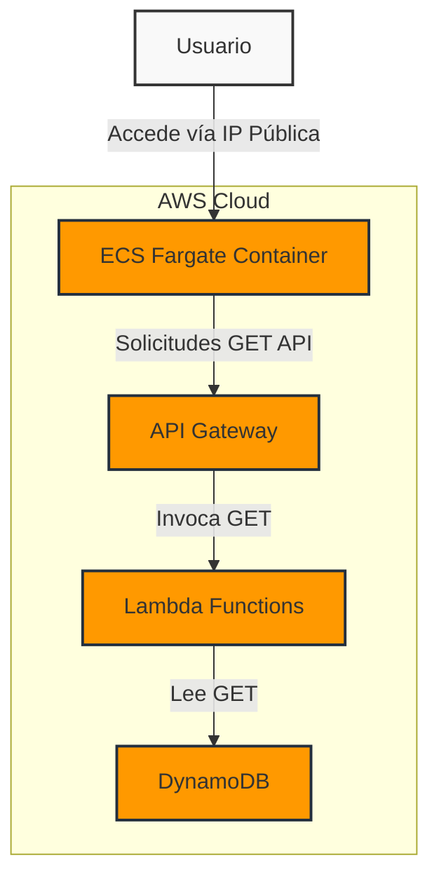
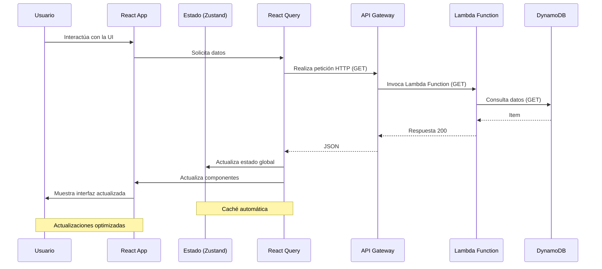

# SpaceX Launches Tracker - Frontend 🚀

[](https://reactjs.org/)
[](https://tailwindcss.com/)
[](https://zustand-demo.pmnd.rs/)
[](https://tanstack.com/query/latest)
[](https://aws.amazon.com/fargate)
[](LICENSE)

_Aplicación web moderna que visualiza y explora los lanzamientos de SpaceX con una arquitectura frontend optimizada_

---

##  Tabla de Contenidos
1. [Descripción del Proyecto](#-descripción-del-proyecto)
2. [Características Principales](#-características-principales)
3. [Estructura del Proyecto](#-estructura-del-proyecto)
4. [Tecnologías y Dependencias](#-tecnologías-y-dependencias)
5. [Configuración y Despliegue](#-configuración-y-despliegue)
    - [Desarrollo Local](#desarrollo-local)
    - [Construcción de la Imagen Docker](#construcción-de-la-imagen-docker)
    - [Despliegue en ECS Fargate](#despliegue-en-ecs-fargate)
6. [Diagramas de Arquitectura](#-diagramas-de-arquitectura)
7. [Componentes Principales](#-componentes-principales)
8. [Autor](#-autor)
9. [Licencia](#-licencia)

## 📝 Descripción del Proyecto

Este proyecto implementa una aplicación web frontend moderna y responsiva para visualizar y explorar los lanzamientos de SpaceX. Utiliza React, Tailwind CSS, Zustand y React Query para proporcionar una experiencia de usuario fluida y eficiente. La aplicación se conecta al backend serverless para obtener datos actualizados y se despliega en AWS ECS Fargate para garantizar alta disponibilidad y escalabilidad.

## ✨ Características Principales

- 🖥️ **Interfaz moderna y responsiva**: Diseñada con React y Tailwind CSS para adaptarse perfectamente a cualquier dispositivo
- 🔄 **Gestión de estado eficiente**: Implementada con Zustand para manejar los datos de cohetes
- 📊 **Visualización de datos interactiva**: Gráficos y estadísticas dinámicas usando Recharts
- 🚀 **Exploración detallada de misiones**: Información completa sobre cada lanzamiento, cohete y plataforma
- ⚡ **Rendimiento optimizado**: Actualización de datos con React Query
- 🔍 **Búsqueda avanzada**: Localiza misiones por su ID
- 📱 **Diseño Mobile-First**: Experiencia óptima en dispositivos móviles y de escritorio

## 📁 Estructura del Proyecto

```
frontend/
├── public/                  # Recursos estáticos
│   ├── images/              # Imágenes e iconos
│   └── favicon.ico          # Favicon del sitio
├── src/
│   ├── components/          # Componentes React
│   │   ├── launches/        # Componentes específicos de lanzamientos
│   │   │   ├── LaunchesSummary.tsx
│   │   │   ├── LaunchesList.tsx
│   │   │   └── ...
│   │   ├── rockets/         # Componentes específicos de cohetes
│   │   │   ├── RocketCard.tsx
│   │   │   ├── RocketGrid.tsx
│   │   │   └── ...
│   │   ├── layout/          # Componentes de estructura
│   │   │   ├── Header.tsx
│   │   │   ├── Footer.tsx
│   │   │   ├── Layout.tsx
│   │   │   └── ...
│   │   ├── sections/        # Secciones principales de la aplicación
│   │   │   ├── Hero.tsx
│   │   │   ├── CategoriesSection.tsx
│   │   │   └── ...
│   │   └── ui/              # Componentes UI reutilizables
│   │       ├── NavLink.tsx
│   │       ├── CategoryCad.tsx
│   │       ├──
│   │       └── ...
│   ├── hooks/               # Hooks personalizados
│   │   ├── useLaunches.ts   # Hook para gestionar lanzamientos
│   │   ├── useRockets.ts    # Hook para gestionar cohetes
│   │   └── ...
│   ├── pages/               # Páginas principales
│   │   ├── HomePage.tsx
│   │   ├── LaunchesPage.tsx
│   │   ├── RocketsPage.tsx
│   │   ├── LaunchpadsPage.tsx
│   ├── store/               # Estado global con Zustand
│   │   ├── rocketStore.ts
│   ├── types/               # Definiciones de tipos TypeScript
│   │   ├── launch.ts
│   │   ├── rocket.ts
│   │   ├── launchpad.ts
│   │   └── ...
│   ├── api/                 # Utilidades y funciones auxiliares
│   │   ├── client.ts        # Cliente API
│   │   └── services/ 
│   │       └── ...
│   ├── App.tsx              # Componente principal
│   └── index.tsx            # Punto de entrada
├── .dockerignore            # Archivos ignorados por Docker
├── .env.example             # Plantilla de variables de entorno
├── Dockerfile               # Configuración de Docker
├── package.json             # Dependencias y scripts
├── README.md                # Documentación
└── tsconfig.json            # Configuración de TypeScript
```

## 🛠️ Tecnologías y Dependencias

| Tecnología | Versión | Propósito |
|------------|---------|-----------|
| **React** | 18.2.0 | Biblioteca principal de UI |
| **Tailwind CSS** | 3.4.1 | Framework de estilos utilitarios |
| **Zustand** | 4.5.1 | Gestión de estado global |
| **React Query** | 3.39.3 | Gestión de estado del servidor y caché |
| **React Router DOM** | 6.21.2 | Enrutamiento en el cliente |
| **Recharts** | 2.10.4 | Visualización de datos y gráficos |
| **Axios** | 1.6.5 | Cliente HTTP para peticiones a la API |
| **TypeScript** | 5.3.3 | Tipado estático para JavaScript |
| **ESLint** | 8.56.0 | Linting y análisis de código |

## 🚀 Configuración y Despliegue

### Desarrollo Local

1. **Clonar el repositorio:**
```bash
git clone <tu-repositorio>
cd frontend
```

2. **Instalar dependencias:**
```bash
npm install
```

3. **Configurar variables de entorno:**
Crea un archivo `.env.local` en la raíz del proyecto:
```
VITE_API_URL=https://<tu-api-gateway>.amazonaws.com/prod
```

4. **Iniciar el servidor de desarrollo:**
```bash
npm start
```

5. **Acceder a la aplicación:**
```
http://localhost:5173
```

### Construcción de la Imagen Docker

1. **Construir la imagen Docker:**
```bash
docker build -t space-x-tracker .
```

2. **Ejecutar la imagen localmente (opcional):**
```bash
docker run -p 8080:80 space-x-tracker
```

3. **Registrar la imagen en Amazon ECR:**
```bash
# Autenticarse en ECR
aws ecr get-login-password --region <tu-region> | docker login --username AWS --password-stdin <tu-account-id>.dkr.ecr.<tu-region>.amazonaws.com

# Etiquetar la imagen
docker tag space-x-tracker:latest <tu-account-id>.dkr.ecr.<tu-region>.amazonaws.com/space-x-tracker:latest

# Subir la imagen
docker push <tu-account-id>.dkr.ecr.<tu-region>.amazonaws.com/space-x-tracker:latest 
```

### Despliegue en ECS Fargate

1. **Crear un clúster de ECS:**
   - Desde el CLI de AWS, ejecuta los siguientes comandos:
```bash
   aws ecs create-cluster --cluster-name tu-cluster-name
```

2. **Crear una definición de tarea:**
   
```JSON
   {
     "family": "mi-task-definition",
     "networkMode": "awsvpc",
     "containerDefinitions": [
       {
         "name": "mi-contenedor",
         "image": "nginx:latest",  # Imagen de ejemplo (puedes usar cualquier imagen de Docker)
         "portMappings": [
           {
             "containerPort": 80,
             "hostPort": 80,
             "protocol": "tcp"
           }
         ],
         "essential": true
       }
     ],
     "requiresCompatibilities": ["FARGATE"],
     "cpu": "256",   # Unidades de CPU (256 = 0.25 vCPU)
     "memory": "512"  # Memoria en MB
   }
```
- Registrar la tarea en ECS

```bash
aws ecs register-task-definition --cli-input-json file://task-definition.json
```


3. **Crear un servicio ECS:**
   Ejecuta la tarea para el servicio de tu contenedor
```bash
   aws ecs run-task \
     --cluster tu-cluster-name \
     --task-definition mi-task-definition \
     --launch-type FARGATE \
     --network-configuration "awsvpcConfiguration={subnets=[tu-subnet-id],securityGroups=[tu-security-group-id],assignPublicIp=ENABLED}"
```

NOTA: Para desplegar en este servicio es clave configurar estos otros 2 servicios de AWS

#### AWS ECR:
- Asegúrate de tener un repositorio ECR creado en la región de AWS donde planeas desplegar tu aplicación.
- Ten a mano la URL del repositorio ECR, ya que la necesitarás para etiquetar y subir tu imagen.


#### AWS VPC:
- Verifica que tu VPC tenga subredes públicas y una puerta de enlace a Internet para que tu aplicación pueda acceder a Internet.

Para realizar eso, puedes seguir estos pasos en la CLI de AWS

### ECR

1. **Crear un Repositorio Privado en ECR**
```bash
   aws ecr create-repository --repository-name nombre-de-tu-repositorio --region tu-region
```

2. **Sigue los pasos para construir la imagen de Docker**

3. **Verificar la Imagen en ECR**
```bash
   aws ecr describe-images --repository-name nombre-de-tu-repositorio --region tu-region
```
### VPC

1. **Crea la VPC***

```bash
   aws ec2 create-vpc --cidr-block 10.0.0.0/16 --region tu-region.
```
- Toma nota del ID de la VPC que se muestra en la salida

2. **Crea las subredes públicas**

```bash
   aws ec2 create-subnet --vpc-id tu-vpc-id --cidr-block 10.0.1.0/24 --availability-zone tu-region-1a --region tu-region
   aws ec2 create-subnet --vpc-id tu-vpc-id --cidr-block 10.0.2.0/24 --availability-zone tu-region-1b --region tu-region
```
- Reemplaza tu-vpc-id con el ID de tu VPC
- Toma nota de los IDs de las subredes

3. **Crea una puerta de enlace a Internet**
 
```bash
   aws ec2 create-internet-gateway --region tu-region
```
- Toma nota del ID de la puerta de enlace a Internet.

4. **Adjunta la puerta de enlace a Internet a la VPC**

```bash
   aws ec2 attach-internet-gateway --vpc-id tu-vpc-id --internet-gateway-id tu-internet-gateway-id --region tu-region
```
- Reemplaza tu-vpc-id y tu-internet-gateway-id con los IDs correspondientes.

5. **Crea una tabla de enrutamiento pública**

```bash
   aws ec2 create-route-table --vpc-id tu-vpc-id --region tu-region
```
- Toma nota del ID de la tabla de enrutamiento.

6. **Crea una ruta a la puerta de enlace a Internet**

```bash
   aws ec2 create-route --route-table-id tu-route-table-id --destination-cidr-block 0.0.0.0/0 --gateway-id tu-internet-gateway-id --region tu-region
```
- Reemplaza tu-route-table-id y tu-internet-gateway-id con los IDs correspondientes.

7. **Asocia la tabla de enrutamiento pública a las subredes públicas**

```bash
   aws ec2 associate-route-table --subnet-id tu-public-subnet-1-id --route-table-id tu-route-table-id --region tu-region
   aws ec2 associate-route-table --subnet-id tu-public-subnet-2-id --route-table-id tu-route-table-id --region tu-region
```

## 📊 Diagramas de Arquitectura

### Arquitectura de la Aplicación



### Flujo de Datos en la Aplicación



## 🧩 Componentes Principales

### Páginas Clave

| Página | Ruta | Descripción |
|--------|------|-------------|
| **Home** | `/` | Dashboard principal con resumen y estadísticas |
| **Lanzamiento y estadísticass** | `/launches` | Lista paginada de todos los lanzamientos, visualizaciones y análisis de datos históricos |
| **Detalle de Lanzamiento** | `/launches/:id` | Información detallada de un lanzamiento específico |
| **Cohetes** | `/rockets` | Catálogo de cohetes con especificaciones técnicas |
| **Plataformas** | `/launchpads` | Información sobre plataformas de lanzamiento |

### Componentes Principales

| Componente | Propósito | Características |
|------------|-----------|-----------------|
| **Launches** | Visualizar resumen de lanzamiento | • Indicadores de éxito/fracaso<br> • Mostrar cronología de lanzamientos<br> • Cantidad de lanzamientos por cohete |
| **Rockets** | Informacion general de los cohetes | • Carrusel de imagenes <br>• Informacion y detalles de cada co |
| **Launchpads** | Mapa interactivo con las zonas de lanzamiento | • Puntos de lanzamiento con informacion a detalle |


## 👨‍💻 Autor

**Sebastian Ballen C** - *Frontend Developer*

* LinkedIn: [Sebastian B.](www.linkedin.com/in/sebastianballencastaneda-softwaredeveloper)
* Email: sebastian.ballenc@gmail.com


## 📄 Licencia

Este proyecto está licenciado bajo la Licencia MIT - vea el archivo [LICENSE](LICENSE) para más detalles.

---

⭐️ **Si te resulta útil este proyecto, ¡no olvides darle una estrella en GitHub!** ⭐️
